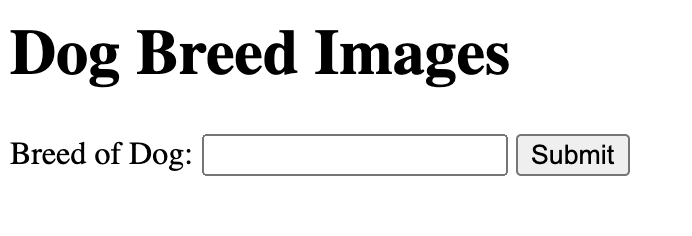
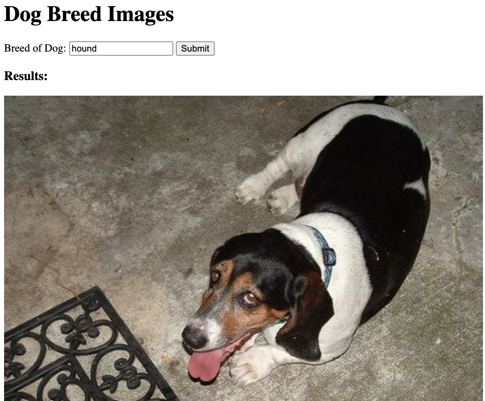

# dog-breeds-api
Practice assignment for working with APIs (part 2)

## Live Demo

[Live Demo](https://7424243.github.io/dog-breeds-api/)

## Screenshots

### Search Section

### Results Section

## Summary

This was a practice assignment is a part two of Thinkful's assignment for working with APIs. The purpose was to gain more experience working with APIs. This app allows the user to specify a dog breed and then they are shown a random image of a dog with the specified breed.

## Built With

* HTML
* CSS
* JavaScript
* jQuery
